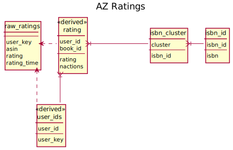

# Amazon Ratings
{: .no_toc}

The [Amazon reviews data set](http://jmcauley.ucsd.edu/data/amazon/) consists of user-provided
reviews and ratings for a variety of products.

Currently we import the ratings-only data from the Books segment of the 2014 data set.

**If you use this data, cite the paper(s) documented on the data set web site.**

Imported data lives in the `az` schema.  The source files are not automatically downloaded.

1. TOC
{:toc}

## Data Model Diagram

- [SVG file](az.svg)
- [PlantUML source](az.puml)

## Import Steps

The import is controlled by the following DVC steps:

`schemas/az-schema.dvc`
:   Run `az-schema.sql` to set up the base schema.

`import/az-ratings.dvc`
:   Import raw BookCrossing ratings from `data/ratings_Books.csv`.

`index/az-index.dvc`
:   Run `az-index.sql` to index the rating data and integrate with book data.

## Raw Data

The raw rating data, with invalid characters cleaned up, is in the `az.raw_ratings` table, with
the following columns:

user_key
:   The alphanumeric user identifier.

asin
:   The Amazon identification number for the product; for a book with an ISBN, this is the ISBN.

rating
:   The book rating.  The ratings are on a 1-5 scale.

rating_time
:   The rating timestamp.

## Extracted Rating Tables

We extract the following tables for Amazon ratings:

`user_ids`
:   Mapping from Amazon's alphanumeric user identifiers to numeric user IDs.

`rating`
:   Rating values suitable for LensKit use, with numeric user and item identifiers. The ratings are
    pre-clustered, so the book IDs refer to book clusters and not individual ISBNs or editions.
    This table has the following columns:

    `user_id`
    :   The user ID.

    `book_id`
    :   The [book code](ids.html#book-codes) for this book; the cluster identifier if available, or the
        ISBN-based book code if this book is not in a cluster.

    `rating`
    :   The rating value; if the user has rated multiple books in a cluster, the median value is reported.

    `nactions`
    :   The number of book actions this user performed on this book.  Equivalent to the number of books in
        the cluster that the user has rated.
