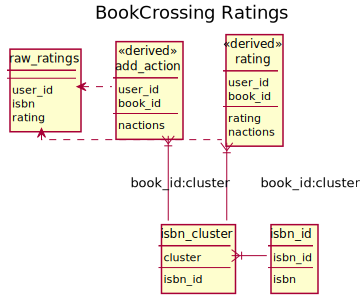

# BookCrossing
{: .no_toc}

The [BookCrossing data set](http://www2.informatik.uni-freiburg.de/~cziegler/BX/) consists of user-provided
ratings — both implicit and explicit — of books.

**If you use this data, cite:**

> Cai-Nicolas Ziegler, Sean M. McNee, Joseph A. Konstan, and Georg Lausen. 2005. Improving Recommendation Lists Through Topic Diversification. Proceedings of the 14th International World Wide Web Conference (WWW '05), May 10-14, 2005, Chiba, Japan.

Imported data lives in the `bx` schema.  The source data files are automatically downloaded and unpacked by
the provided scripts and DVC stages.

1. TOC
{:toc}

## Data Model Diagram

## Import Steps

The import is controlled by the following DVC steps:

`data/BX.dvc`
:   Unpack the BookCrossing zip file.

`data/BX-CSV-Dump.zip.dvc`
:   Download the BookCrossing zip file.s

`schemas/bx-schema.dvc`
:   Run `bx-schema.sql` to set up the base schema.

`import/bx-ratings.dvc`
:   Import raw BookCrossing ratings from `data/BX-Book-Ratings.csv`.

`index/bx-index.dvc`
:   Run `bx-index.sql` to index the rating data and integrate with book data.

## Raw Data

The raw rating data, with invalid characters cleaned up, is in the `bx.raw_ratings` table, with
the following columns:

user_id
:   The user identifier (numeric).

isbn
:   The book ISBN (text).

rating
:   The book rating.  The ratings are on a 1-10 scale, with 0 indicating an implicit-feedback record.

## Extracted Rating Tables

We extract the following tables for BookCrossing ratings:

`rating`
:   The explicit ratings (`rating > 0`) from the raw ratings table.

`add_action`
:   Records of users adding books, either by rating or through an implicit feedback action,
    without rating values.

Both of these tables are pre-clustered, so the book IDs refer to book clusters and not individual
ISBNs or editions.  They have the following columns:

`user_id`
:   The user ID.

`book_id`
:   The [book code](ids.html#book-codes) for this book; the cluster identifier if available, or the
    ISBN-based book code if this book is not in a cluster.

`rating`
:   The rating value; if the user has rated multiple books in a cluster, the median value is reported.
    This field is only on the `rating` table.

`nactions`
:   The number of book actions this user performed on this book.  Equivalent to the number of books in
    the cluster that the user has added or rated.
