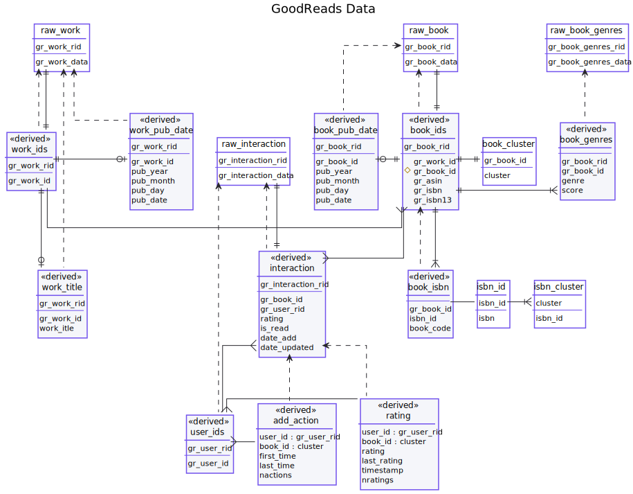

# GoodReads (UCSD Book Graph)
{: .no_toc}

We import GoodReads data from the [UCSD Book Graph](https://sites.google.com/eng.ucsd.edu/ucsdbookgraph/home)
for additional book and user interaction information.  The source files are not automatically downloaded; you
will need the following:

- Books
- Book works
- Authors
- Book genres
- Book series
- **Full** interaction data

We do not yet support reviews.

**If you use this data, cite the paper(s) documented on the data set web site.**

Imported data lives in the `gr` schema.

1. TOC
{:toc}

## Data Model Diagram

- [SVG file](goodreads.svg)
- [PlantUML source](goodreads.puml)

## Import Steps

The import is controlled by the following DVC steps:

`schemas/gr-schema.dvc`
:   Run `gr-schema.sql` to set up the base schema.

`import/gr-*.dvc`
:   Import raw GoodReads data from files under `data/`

`index/gr-index-books.dvc`
:   Run `gr-index-books.sql` to index the book data and extract identifiers.

`index/gr-book-info.dvc`
:   Run `gr-book-info.sql` to extract additional book and work metadata.

`index/gr-index-ratings.dvc`
:   Run `gr-index-ratings.sql` to index the rating and interaction data.

## Raw Data

The raw rating data, with invalid characters cleaned up, is in the various `gr.raw_*` tables:

- `raw_book`
- `raw_work`
- `raw_author`
- `raw_series`
- `raw_book_genres`
- `raw_interaction`

Each table has the following columns:

gr_*type*_rid
:   Numeric record identifier generated at import time.  Throughout this page, we will refer to these as record identifiers; they are distinct from the identifiers GoodReads uses for books and works, as those are not known until the JSON is unpacked.

gr_*type*_data
:   `JSONB` column containing imported data.

## Extracted Book Tables

We extract the following tables for book and work data:

`work_ids`
:   GoodReads work identifiers.

`book_ids`
:   GoodReads book identifiers.  This maps each GoodReads book record identifier to the following identifiers:

    - book ID
    - work ID
    - ASIN
    - ISBN 10 (`gr_isbn`)
    - ISBN 13 (`gr_isbn13`)

    This table extracts the *textual* versions of ISBNs and ASINs directly from the `raw_book` table.  It does not resolve them to ISBN IDs.

`book_isbn`
:   Map GoodReads books to ISBN IDs and book codes.  This does **not** use ASINs, just ISBN-10 and ISBN-13s.

`book_genres`
:   Genre membership (and scores) for each book.  This is a direct extract of the book genres file from UCSD.

`work_title`
:   The title of each work.

`book_pub_date`
:   The publication date of each book.  It extracts the year, month, and day; if all three are present, then `pub_date` contains the date as an SQL date.  These are the `publication_*` fields in the book JSON data.

`work_pub_date`
:   The original publication date of each work.  Extracted like `book_pub_date`, but from a work's `original_publication_*` fields.

`book_cluster`
:   The book cluster each book is a member of.

## Extracted Interaction Tables

We extract the following tables for book ratings and interactions (add-to-shelf actions):

`user_info`
:   Mapping between user record IDs and GoodReads user IDs.

`interaction`
:   Extract of basic information about each entry in the Interactions file.  These interactions
    represent an add-to-shelf action, optionally with a rating.  We extract the following:

    `gr_interaction_rid`
    :   The interaction record identifier (PK)

    `gr_book_id`
    :   GoodReads book ID

    `gr_user_rid`
    :   User record identifier (we use record IDs instead of user IDs to keep them numeric)

    `rating`
    :   The 5-star rating value (if provided)

    `is_read`
    :   `isRead` flag from original JSON data.

    `date_added`
    :   The date the book was added to the shelf.

    `date_updated`
    :   The update date for this interaction.

`rating`
:   Rating table suitable for use in LensKit.  This is aggregated
    by book cluster, and contains both the median rating and the
    last rating, along with the median update date as the timestamp.

`add_action`
:   Add-action table suitable for use in LensKit.  Also aggregated by book cluster,
    with the first and last (update) date as the timestamps, and number of interactions
    with this book.
