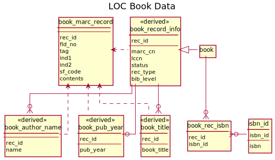

# Library of Congress
{: .no_toc}

One of our sources of book data is the Library of Congress [MDSConnect Books](https://www.loc.gov/cds/products/MDSConnect-books_all.html) bibliography records.

We download and import the XML versions of these files.

Imported data lives under the `locmds` schema.

1. TOC
{:toc}

## Data Model Diagram

## Import Steps

The import is controlled by the following DVC steps:

`schemas/loc-mds-schema.dvc`
:   Run `loc-mds-schema.sql` to set up the base schema.

`import/loc-mds-books.dvc`
:   Import raw MARC data from `data/loc-books/`.

`index/loc-mds-index-books.dvc`
:   Run `loc-mds-index-books.sql` to index the book data and extract tables.

`index/loc-mds-book-info.dvc`
:   Run `loc-mds-book-info.sql` to extract additional book data into tables.

## Raw Book Data
{: #raw}

The `locmds.book_marc_fields` table contains the raw data imported from the MARC files, as MARC fields.  The LOC book data follows the [MARC 21 Bibliographic Data format](https://www.loc.gov/marc/bibliographic/); the various tags, field codes, and indicators are defined there.  This table is not terribly useful on its own, but it is the source from which the other tables are derived.

It has the following columns:

`rec_id`
:   The record identifier (generated at import)

`fld_no`
:   The field number.  This corresponds to a single MARC field entry; rows in this table
    containing data from MARC subfields will share a `fld_no` with their containing field.

`tag`
:   The MARC tag; either a three-digit number, or `LDR` for the MARC leader.

`ind1`, `ind2`
:   MARC indicators.  Their meanings are defined in the MARC specification.

`sf_code`
:   MARC subfield code.

`contents`
:   The raw textual content of the MARC field or subfield.

## Extracted Book Tables

We then extract a number of tables and views from this MARC data.  These tables include:

`book_record_info`
:   Code information for each book record.

    - MARC Control Number
    - Library of Congress Control Number (LCCN)
    - Record status
    - Record type
    - Bibliographic level

    More information about the last three is in the [leader specification](https://www.loc.gov/marc/bibliographic/bdleader.html).

`book`
:   A subset of `book_record_info` intended to capture the actual books in the collection,
    as opposed to other types of materials.  We consider a book to be anything that has MARC
    record type ‘a’ or ‘t’ (language material), and is not also classified as a government
    record in MARC field 008.

`book_rec_isbn`
:   Map book records to their ISBNs.

`book_author_name`
:   Author names for book records.  This only extracts the primary author name (MARC field 100
    subfield ‘a’).

`book_pub_year`
:   Book publication year (MARC field 260 subfield ‘c’).

`book_title`
:   Book title (MARC field 245 subfield ‘a’).
