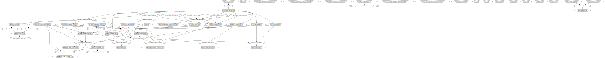

# Design and Implementation

These data and integration tools are designed to support several goals:

- Complete end-to-end reproducibility with a single command (`dvc repro`)
- Self-documenting import stage dependencies
- Automatically re-run downstream steps when a data file or integration logic changes
- Support updates (e.g. new OpenLibrary dumps) by replacing the file and re-running
- Efficient import and integration

```{toctree}
status
layout
dataset
```

## Implementation Principles

These goals are realized through a few technology and design decisions:

- Script all import steps with a tool that can track stage dependencies and check whether a stage is up-to-date ([DVC](https://dvc.org)).
- Stage each data source with a schema file, a raw import, and subsequent SQL files that reformat and extract data into more usable format.
- Implement as much data integration as possible in declarative SQL.
- Make SQL scripts re-runnable, so they will either refresh or delete and recreate their outputs. Deletes cascading to downstream steps are fine, because the stage runner will re-run those stages anyway.


## DVC Dependency Graph



- [SVG file](../pipeline.svg)
- [GraphViz source](../pipeline.dot)
